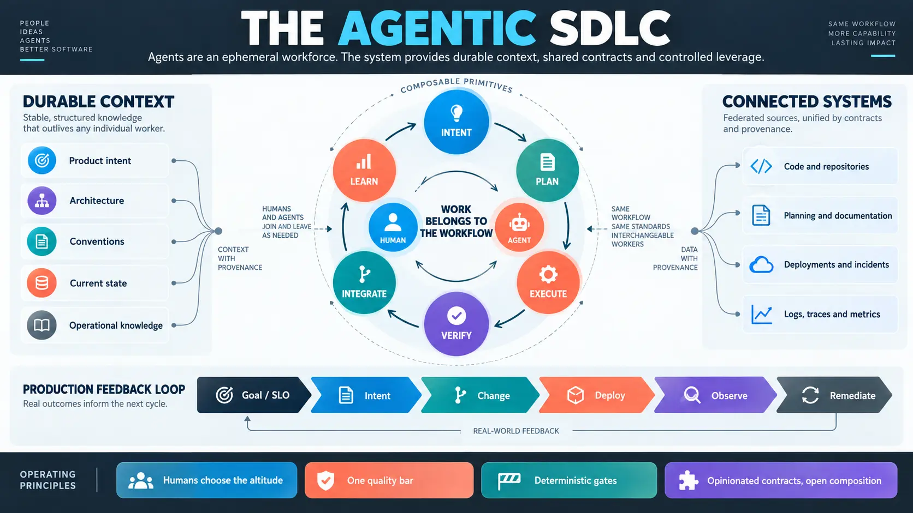

Agents are an ephemeral workforce. They arrive without institutional memory, perform work, and disappear. This makes durable context more important than ever.

An Agentic SDLC gives human and agent developers the same working substrate: documented intent, architecture, conventions, current state, operational knowledge, reproducible environments, and observable workflows. Both are held to the same project-defined quality bar, and either should be able to enter or leave a workflow without losing its state.

The system should support precise human control, highly leveraged agent execution, and every point between them. Humans choose the altitude; the system manages the coordination complexity.

## The core ideas

- **Work belongs to the workflow.** Plans, decisions, evidence, authority, and outcomes persist independently of the worker or conversation.
- **Development is composable.** Intent, planning, execution, verification, integration, observation, and learning are reusable primitives rather than one mandatory pipeline.
- **Context is federated.** Repositories, planning tools, documentation, deployments, incidents, logs, traces, and metrics remain connected with provenance.
- **Production closes the loop.** Runtime evidence can diagnose failures, validate changes, measure goals, and trigger governed remediation.
- **Known rules become deterministic gates.** Judgment and autonomy then scale with the maturity and risk of the work.
- **Tools serve humans and agents.** Markdown, CLIs, reproducible environments, machine-readable contracts, and rich multimodal artifacts provide a shared and inspectable foundation.

The goal is a system that is fit for purpose. It should avoid both unstructured vibe coding and orchestration complexity for its own sake, while leaving room to compose more powerful development systems from understandable parts.

## Explore the philosophy

[Open the immersive Agentic SDLC overview](/agentic-sdlc/)

The underlying philosophy and future protocols are being developed in the [agentic-sdlc repository](https://github.com/kirksw/agentic-sdlc).
