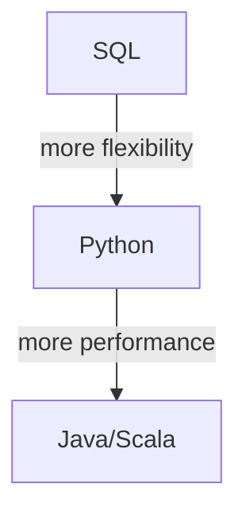

There has been a large shift in the industry in recent years to moving to python for data engineering. Spark one of the leading distributed data processing engines has great support for python via the Pyspark library, allowing users to write high performance distributed data processing on spark from the comfort of python.

In this article I want to touch on some high-level topics relating to using pyspark which I have seen skimmed over at companies where I have worked at leading to varied and generally poor data pipeline quality.

## To python or not to python..

One of point important points to consider when building a pipeline is whether python is the best language to use for that use-case? Many pipelines can be more concisely written in SQL and more performant in Java/Scala.

Generally I believe the best approach is to use the simplest solution which meets the requirements, and then only if necessary move to a more complex solution. No one is going to be impressed if you write a spark job in Java when it could have been done in SQL if both could meet the requirements.

Additionally if we consider Databricks, if you have a lot of jobs you can end up creating a lot of job clusters and optimizing the sizing can be difficult. Using SQL allows you to target a sql warehouse cluster and let databricks scale this, which could end up minimising latency and reducing costs.

Generally the flow I have in mind is as below:



There is a however a trade-off for the additional flexibility and performance and that is technical debt, and we should choose the best tool for the users and capabilities of the team. A tech company will have no problem building and running scala jobs, but a company with a lot of data analysts would be best suited to stick to sql with the odd python job.

## Notebooks != Production

To me notebooks have been marketed as the "low code" approach for data engineering, but in reality they are a double edged sword. They are great for exploration and prototyping, but when it comes to production they are a nightmare.

Companies like Databricks heavily promote using notebooks, adding features like version control, co-pilots, etc. Their ~~solutions architects~~ sales people will even recommend them throughout the layers of the company as best practice. There is so much marketing from these companies that some colleagues didn't even know you could submit jobs in another way. Remember if you drink all the cool-aid you aren't using spark you are using databricks.

Testability is the first big issue which comes to mind with notebooks, If we consider the databricks variety they have a lot of magic variables injected such as the spark context, dbutils, widgets, etc. Additionally if you want to write unit tests, these should be run in a CI/CD pipeline, and running a notebook in a cicd pipeline sounds like a nightmare. So you would have to convert the notebook to a python package, which then begs the question why do you need the notebook anymore?

There are other issues such as development in a proper IDE being much more efficient than in a notebook, that it's easier to reuse code between python packages.

What then is the solution? I would recommend using notebooks for exploration and prototyping if you need to, but then taking the explicit step of converting the code to a python package for production. This way you get the best of both worlds, and you can ensure that your code is testable, maintainable and reusable.

## To write performant code, use the pyspark api and connectors you must

Did you know all the non-pyspark python code you run only executes on the driver node? Yea that 5 node spark cluster you have is only running with maximum 20% utilization, sounds expensive and slow right?

You would be surprised in how many instances I have seen write code like below, which fetches synchronously pulls data from an api and then creates a dataframe from it. Only the last 4 lines are executed in a distributed fashion. The writing is done using a connector which is optimised for distributed writing.

```python
import pyspark.sql.functions as f
import requests

# synchronous fetch on driver node
record_list = []
records = requests.get("https://api.example.com/records").json()
for record in records:
  record_list.append(record)

# create dataframe from list (backed by RDDs which are distributed)
record_df = spark.createDataFrame(record_list)

# distributed execution
bad_records = record_df.filter(f.col("status") == "bad"))
good_records = record_df.filter(f.col("status") == "good"))
good_records.write.table("product_name.staging.good_records")
bad_records.write.table("product_name.staging.bad_records")
```

One of the most important things to remember when working with spark via python - is to heavily use built in functions from pyspark - and I would be more strict use only the dataframe api, with UDFs only if necessary. These functions utilise the native and high performance jvm (or c++\*) libraries of spark to ensure your data is processed blazingly fast in a distributed fashion.

I have found the dataframe api to be brilliant for most use-cases, have supported a lot of colleagues over the years convert their python code into the dataframe api with huge performance improvements. I would recommend avoiding the RDD api unless you need to, as it is much easier to write non-performant code.

I would also encourage you to use native spark connectors for reading and writing data, as these are written in scala and optimised for distributed reading and writing. However Spark 4.0 will expose a python data source API to make building distributed connectors in python possible. As the spark kafka connector is very good, I would recommend using kafka as the common interface for streaming data, replicating data from other sources using tools like kafka connect. Batch data can be easily and efficiently read from s3 or other storage systems using the native spark connectors.

| Note: you can use `pandas api on spark` but honestly don't it was essentially integrated because there is a lot of legacy pandas code, modern libraries like polars have a more consistent api and are similar to the dataframe api in that both are based on lazy execution.

## Chaining transformations

One thing I see quite often is a pipeline which started simple, but as requirements grew the pipeline became more complex and the logic becomes harder to maintain. Here the `transform` function can be used to chain complex transformations together, and keep the codebase clean and maintainable by breaking the complexity into logically function chunks.

Below is an example from a pokemon interview challenge I did a while back, where the code is broken into smaller functions which are chained together to create the final dataframe, imagine what this would look like if it all was one big chain - yuck! I hope you can see how this can be used as a tool to keep the codebase clean and maintainable, you could imagine that each of these functions was a requirement and so I could unit test each of them to ensure I am meeting the requirements.

```python
def load_pokemon(spark: SparkSession, pokemon_path: str) -> DataFrame:
    return spark.read \
        .format("json") \
        .option("multiline", "true") \
        .schema(detailed_pokemon_schema) \
        .load(pokemon_path)


def parse_games(df: DataFrame, games=["red", "blue", "leafgreen", "white"]):
    """filter for only pokemon that are specified in the game list"""
    group_cols = ["id", "name", "base_experience", "weight", "height", "order", "types", "sprites"]
    return df \
        .withColumn("games", f.explode("game_indices.version.name")) \
        .filter(f.col("games").isin(games)) \
        .groupBy(*group_cols) \
        .agg(f.collect_list("games").alias("games"))


def parse_types(df: DataFrame):
    """parse types into a mapping"""
    df_join = df \
        .withColumn("types", f.explode("types")) \
        .withColumn("type_slot", f.concat(f.lit("type_slot_"), f.col("types.slot"))) \
        .withColumn("type_name", f.col("types.type.name")) \
        .groupBy("name").pivot("type_slot").agg(f.first("type_name"))

    return df.join(df_join, on="name").drop("types")


def parse_sprite(df: DataFrame):
    """parse front_default sprite to be used a sprite"""
    return df \
        .withColumn("sprite", f.col("sprites.front_default")) \
        .drop("sprites")


def calculate_bmi(df: DataFrame):
    """calculates pokemon bmi (weight / height^2)"""
    return df.withColumn("bmi", f.col("weight") / f.pow(f.col("height"), f.lit(2)))


def capitalize_name(df: DataFrame):
    """capitalizes first letter of pokemon name"""
    capitalize_first = f.udf(lambda x: str.capitalize(x))
    return df.withColumn("name", capitalize_first("name"))


if __name__ == "__main__":
    """sample code"""
    ss = SparkSession.builder.master("local[*]").appName("pokemon").getOrCreate()

    df_poke = load_pokemon(ss, "data/raw/pokemon/*.json") \
        .withColumn("games", f.explode("game_indices.version.name")) \
        .filter(f.col("games").isin(games)) \
        .groupBy(*group_cols) \
        .agg(f.collect_list("games").alias("games"))
        .transform(parse_sprite) \
        .transform(parse_types) \
        .transform(calculate_bmi) \
        .transform(capitalize_name)

    df_poke.write.mode("overwrite").parquet("pokemon_processed")

```

## Summary

I hope this somewhat high-level collection of thoughts can help when building spark pipelines in python. I have seen a lot of pipelines which have been built in a sub-optimal way, and I hope this can help you avoid some of the pitfalls I have seen. If I write a part 2 it will be around testing and deployment side of this.

I'm not using spark that much at my current company as we are dealing with more complex real-time streaming use-cases, where we are using DataFlow (Apache Beam) together with BigQuery, Kafka, Airflow & DBT.

Let me know if you have any thoughts or questions, I would love to hear them.
