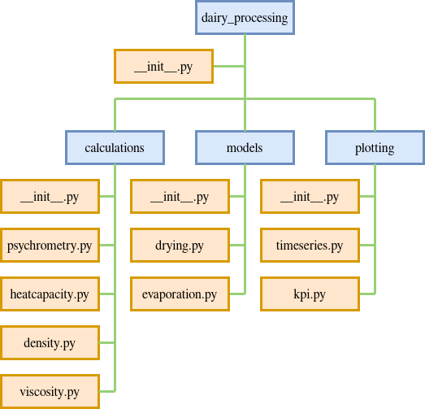

It's not suprise that new developers are confused when it comes to developing python libraries, there has been major changes over the years when it comes to how to work with python packages, and currently you may ask yourself what to use out of `setup.py`, `setup.cfg` and `pyproject.toml`. Before we look at these, it is important to first make sure we properly understand python modules and packages.

### Python Modules

In python a module is simply a file with a `.py` extension which contains related code, which could be functions, classes, variables or etc.

For example lets define a function to greet a user:

```python
def hello_name(name):
    print(f"hello {name}")
```

To have this function store in a welcome module, we just need to save this code in a file named `welcome.py`. 

This module can be used in one of two ways, either by importing the entire module, or importing a specific function. Never use `from module import *` as then you have no transparency on where certain functions/classes were imported from.

```python
import welcome

welcome.hello_name("bob") # prints "hello bob"
```

```python
from welcome import hello_name

hello_name("tim") # prints "hello tim"
```

Module introduce several benefits:
- Improved development
- Code re-uses
- Separate namespaces

Finally a note on how python finds these modules. When `import welcome` is evaluated, the interpreter will search three locations.
- The directory containing the input script (or current directly when no file is specified)
- PYTHONPATH (a list of directories with the same syntax as PATH)
- The installation-dependant default (by convention including a site-packages directory handled by the site module).

### Python Packages

Python collection of modules intended to be installed and used together. When developing a large application you will probably end up with multiple modules which need to be organized, this is what a package does.

In python a package (or subpackage) is a folder containing one or more modules and a `__init__.py` file, which can be empty or contain some initialization code for the package.



We can import certain modules from any of these packages using dot notation. For example to import module_1 from the above package, we could use either of the following code snippets

```python
import dairy_processing.calculations.density
```

or

```python
from dairy_processing.calculations import density
```

> Note: We can also import specific functions as shown in the python modules section.

### Packaging flow

Publishing a package requires a flow from the author’s source code to an end user’s Python environment. The steps to achieve this are:

- Have a source tree containing the package. This is typically a checkout from a version control system (VCS).

- Prepare a configuration file describing the package metadata (name, version and so forth) and how to create the build artifacts. For most packages, this will be a pyproject.toml file, maintained manually in the source tree.

- Create build artifacts to be sent to the package distribution service (usually PyPI); these will normally be a source distribution (“sdist”) and one or more built distributions (“wheels”). These are made by a build tool using the configuration file from the previous step. Often there is just one generic wheel for a pure Python package.

- Upload the build artifacts to the package distribution service.

At that point, the package is present on the package distribution service. To use the package, end users must:

- Download one of the package’s build artifacts from the package distribution service.

- Install it in their Python environment, usually in its site-packages directory. This step may involve a build/compile step which, if needed, must be described by the package metadata.

These last 2 steps are typically performed by pip when an end user runs pip install.

### Pyenv and Poetry to the rescue

Poetry is a package which helps manage python packaging and dependency management. Pyenv allows you to manage multiple python versions on your computer. Installation of these tools is out of the scope of this guide.

First we want to ensure our package is using the correct python version, this can be done by running `pyenv local 3.10.5` from within the root directory (note: multiple versions can be selected using `pyenv local 3.8.13 3.9.13 3.10.5` which would be required to run tox locally). Next we want to init a poetry project, which can be done using `poetry init`. Don't worry about specifiying dependencies interactively as these can be added easily later,  it's important that the name is same as the name of the root package.

If you check the `pyproject.toml` file you should have something similar to below.

```toml
[tool.poetry]
name = "rootpackage"
version = "0.0.0"
description = "test package"
authors = ["Your Name (your.name@email.com)"]

[tool.poetry.dependencies]
python = "^3.10"

[tool.poetry.dev-dependencies]

[build-system]
requires = ["poetry-core>=1.0.0"]
build-backend = "poetry.core.masonry.api"
```

You need to ensure that your existing package is in a subfolder `./rootpackage` or `./src/rootpackage` and that there is a `__init__.py` file present. If your package needs dependencies, these can be added with `poetry add {depa} {depb}`, development dependencies can be added using the -D flag `poetry add -D pytest`. 

You can install the package and dependencies locally using `poetry install`, you can build the package using `poetry build` and you can publish the package using `poetry publish`.

### Library inconsistency.. 

In theory we can use `pyproject.toml` to define all our project metadata and configuration for different tooling, however reality is a little more complicated. Some tools fully support `pyproject.toml`, some have partial support and some don't support it at all. In practice this means you may have some files like `tox.ini` and `setup.cfg` to contain certain configurations.


#### flake8

Flake8 is one the current python packages which chooses to ignore the `pyproject.toml` file, meaning that the easiest way to setup the configuration is to add code snippet to one of either `setup.cfg`, `tox.ini` or `.flake8`

```ini
[flake8]
max-line-length = 88
extend-ignore = E203
per-file-ignores = __init__.py:F401

```

#### pytest

pytest is a library which has implemented a bridge to the existing `.ini` configuration from version 6.0, in future they will fully utilize the rich TOML format and as such have reserved `[tool.pytest]` for this future use.

```toml
# pyproject.toml
[tool.pytest.ini_options]
minversion = "6.0"
addopts = "-ra -q"
testpaths = [
    "tests",
    "integration",
]
```

#### tox

Tox has partial support for `pyproject.toml` by offering to inline existing ini-style fomat under the `tool.tox.legacy_tox_ini` key as a multi-line string. An example of this is shown below.

```toml
[tool.tox]
legacy_tox_ini = """
[tox]
envlist = py27,py36

[testenv]
deps = pytest >= 3.0.0, <4
commands = pytest
"""
```

Typically it is easier to avoid this and use the `tox.ini`, tox are targetting full toml support with their new release.


### Summary

Python has moved away from setup.py and setup.cfg to the new pyproject.toml file, most tools support `pyproject.toml` in some form, however don't expect them all to be perfect, and there are some who just don't support it yet. It is now easier than ever to setup a new package, but there is a lot of conflicting documentation due to this migration.

Poetry is a powerful tool to assist with managing packaging, and we didn't even scratch the surface here. In a future post I will walk through how this is actually setup and used in a DevOps pipeline along with all the common tooling (pypi, flake8, sphinx, coverage, pytest). There are also alternatives like hatch worth investigation, and also now more than ever, it is worth considering whether these tools are even required.